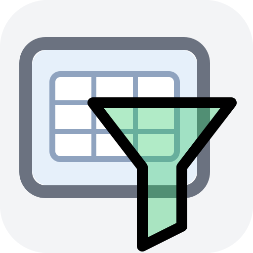

# Table Filter (Chrome Extension)

**Table Filter** is a Chrome extension that adds in-page text filtering for long, paginated album lists.

It currently supports Facebook photo albums, where you can try it right now. You can also try it on our test page: [Table Filter Playground](https://table-filter.stansult.com).

## Why

On long album lists, browser page search (`Cmd/Ctrl + F`) only works on albums currently loaded in the DOM.
Table Filter is designed to make finding albums faster by adding filtering controls directly in the page flow.

## How It Works

- Click the extension icon to open/close the in-page Table Filter panel.
- Type a query to filter loaded albums by title.
- Click `Auto-load` to keep loading additional album batches, then `Stop` to stop.
- Click `Rescan` to re-read albums already present in the DOM.
- Press `Esc` while focused in the filter input to close the panel.

### Query Behavior

- Unquoted query: split into words, all words must appear in title (order-independent).
- Quoted query (`"..."` or `'...'`): exact phrase match in title.

Example:
- `my birthday` matches titles that contain both words anywhere.
- `"my birthday"` matches titles that contain that exact phrase.

### While Filtering Is Active

- An inline notice appears near the Albums area (`Table Filter: active...`).
- Newly loaded non-matching cards may briefly appear dim before being hidden.
- While `Auto-load` is active, the panel shows a warning that page scroll/jumps may occur.

## Product Direction

### Current Support

- Facebook album pages (`https://www.facebook.com/<user>/photos_albums`) - first PoC target

### Principles

- Generic architecture for site-specific adapters
- Facebook support first
- Additional sites can be added over time when they need the same capability

## How to Install

### Public version

Install public version from Chrome Web Store:
<a href="https://chromewebstore.google.com/detail/hflbafejehpoclienjonceojnnlckahm">Table Filter</a>.

The Web Store listing may lag behind the latest code due to review time.

### Development mode

1. Clone or download this repository.
2. Open Chrome and go to `chrome://extensions`.
3. Enable **Developer mode**.
4. Click **Load unpacked**.
5. Select the project folder.

#### Packaging for Chrome Web Store

- Create upload zip: `npm run package`
- Bump patch + package: `npm run package:patch`

#### Table Filter Playground

Use [Table Filter Playground](https://table-filter.stansult.com) to test long-list and auto-load behavior locally.

## Notes

- Table Filter is not affiliated with or endorsed by Meta/Facebook.
- This project focuses on user-triggered, in-browser filtering workflows.
- There is currently no options page; behavior is controlled from the in-page panel.
- Privacy policy: [`PRIVACY.md`](PRIVACY.md)
